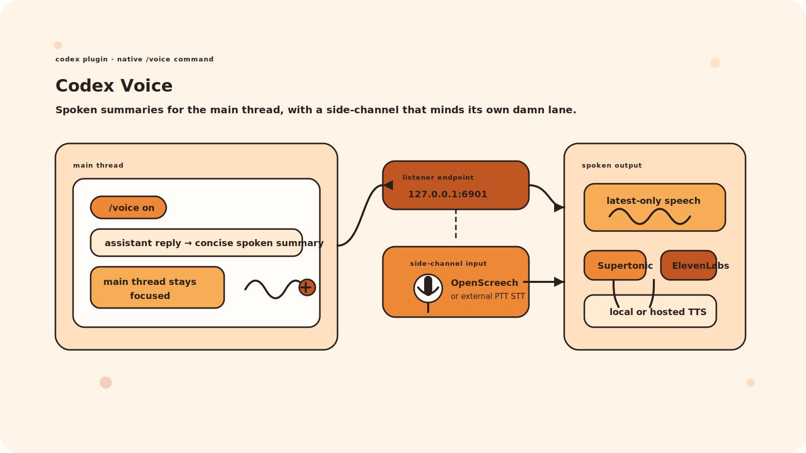
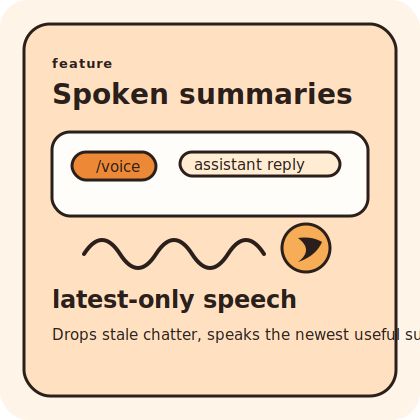
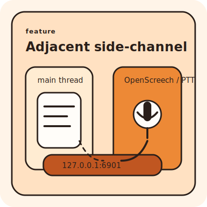
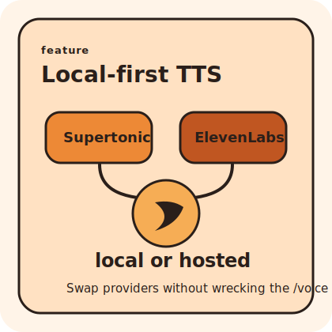

# Codex Voice

<p align="center">
  
</p>

Codex Voice is a Codex plugin that adds a native `/voice` command for per-thread spoken summaries and adjacent side-channel input. Pair it with OpenScreech for a versatile, customizable STT utility and Supertonic for local TTS; ElevenLabs is supported as a hosted TTS alternative.

Normal main-thread input remains the primary command path. When voice is active, Codex keeps technical work in the thread and speaks concise summaries of main-thread replies. External STT/PTT clients can post adjacent questions or notes to the displayed local endpoint without interrupting active main-thread work.

<p align="center">
  
  
  
</p>

## Status

This repository contains the plugin scaffold, native `/voice` command, MCP lifecycle tools, per-thread port allocation, settings/secrets handling, TTS provider resolution, local side-channel STT listener, automatic thread watcher, spoken-summary tool, and Git marketplace metadata for distribution.

The installed plugin path has been smoke-tested locally: `/voice on` starts a listener, speaks the online announcement through the configured TTS provider, accepts OpenAI-compatible side-channel STT POSTs, records them without starting or steering the main Codex thread, answers them aloud through a fast local LM Studio sidecar by default, and tails the active thread rollout so assistant text is spoken automatically.

## Install

Install directly from GitHub:

```bash
codex plugin marketplace add https://github.com/rewinksi/codex-voice
codex plugin add codex-voice@codex-voice
```

For local development from a checkout:

```bash
codex plugin marketplace add /path/to/Codex-Voice
codex plugin add codex-voice@codex-voice
```

Start a new Codex thread after installing or reinstalling so the `/voice` command, skill, and MCP tools are loaded into that thread.

## Commands

- `/voice on`
- `/voice off`
- `/voice status`

`/voice on` must print the listener endpoint as the first visible line. Configure an adjacent-question push-to-talk STT client to send OpenAI-compatible chat completion requests to that endpoint. Keep your primary main-thread PTT button configured to type or submit directly into Codex.

## Local Files

- `~/.codex/voice/settings.json`: non-secret voice settings
- `~/.codex/voice/voice_env`: local secrets such as `ELEVENLABS_API_KEY`
- `~/.codex/voice/sessions.json`: active listener registry

The default listener host is `127.0.0.1`, and ports start at `6901`.

## STT Endpoint

`/voice on` prints the endpoint first:

```text
Voice listener endpoint: http://127.0.0.1:6901/v1/chat/completions
```

Accepted POST shapes:

```json
{ "messages": [{ "role": "user", "content": "run the tests" }] }
```

```json
{ "text": "run the tests" }
```

```json
{ "transcript": "run the tests" }
```

Health and setup helpers:

```text
GET /healthz
GET /v1/models
```

Endpoint POSTs are side-channel only. They are recorded in `~/.codex/voice/side-channel.jsonl`, immediately acknowledged aloud with a varied short phrase, answered aloud through a fast local LM Studio sidecar with recent thread context, and never call `turn/start`, `turn/steer`, or otherwise interrupt main-thread work. Ollama and a slower read-only `codex exec` sidecar remain available through settings.

Main-thread speech is latest-only. When several assistant updates land while speech is already playing, Codex Voice drops the stale backlog and speaks only the newest useful summary after the current audio finishes.

All spoken output inside a listener process uses one shared speech queue, so side-channel acknowledgements, side-channel answers, and main-thread summaries do not talk over each other.

## TTS Providers

Supported providers:

- Supertonic at `http://127.0.0.1:7788` for local TTS
- ElevenLabs via `ELEVENLABS_API_KEY` in `~/.codex/voice/voice_env` as a hosted streaming TTS alternative

For STT, this plugin expects an external push-to-talk client. OpenScreech is a good pairing when you want a versatile and customizable local STT utility that can target the displayed listener endpoint.

Secrets belong in `voice_env`, not `settings.json`.

## Spoken Style

Spoken personality is configurable in `~/.codex/voice/settings.json` under `voiceStyle`. Use it for local preferences such as concise kiwi humour, dry sarcasm, or stricter professional mode without hardcoding one personality for every install.

Side-channel acknowledgement words are configurable under `sideChannel.acknowledgementWords`.

## Latency Notes

The fastest perceived loop comes from short spoken summaries, latest-only speech, a warm local TTS service, and avoiding long code/log narration. The watcher uses a short debounce so fast tool chatter collapses into one current update. Side-channel generation starts while the acknowledgement is speaking, then waits a short breath before the answer. ElevenLabs voice IDs are reused when configured and cached after lookup, avoiding repeated `/v1/voices` calls. Supertonic is local but currently returns complete audio rather than streaming partial audio. ElevenLabs uses the HTTP speech streaming endpoint by default when `tts.provider` is `elevenlabs`, piping audio to `ffplay` or `mpv` when available and falling back to buffered playback otherwise.

For Gemma 4 in LM Studio, the default side-channel prompt prefixes messages with `/nothink`, sends `reasoning.effort: "none"`, keeps recent context lean, and allows enough response-token headroom for Gemma to reach final content quickly.

ElevenLabs also offers WebSocket input streaming. That is best suited for partial text generation or word-alignment workflows; Codex Voice uses HTTP streaming first because spoken summaries are usually complete short phrases.

## Development

Run tests:

```bash
npm test
```

Validate the plugin:

```bash
python3 /Users/rewi/.codex/skills/.system/plugin-creator/scripts/validate_plugin.py /path/to/codex-voice
```
